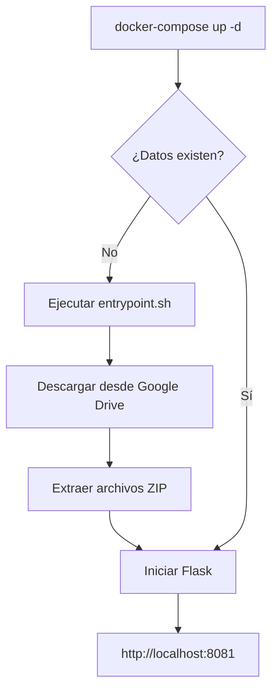

# 📦 TrackVis - Resumen de Deployment con Docker

## ✅ Configuración Completada

Tu repositorio TrackVis está **100% listo** para deployment en GitHub con descarga automática de datos desde Google Drive.

---

## 📁 Archivos Docker Creados

### Archivos de Configuración

| Archivo | Descripción | Estado |
|---------|-------------|--------|
| **Dockerfile** | Imagen Docker optimizada | ✅ Listo |
| **docker-compose.yml** | Orquestación con volúmenes persistentes | ✅ Listo |
| **.dockerignore** | Optimización del build | ✅ Listo |
| **scripts/entrypoint.sh** | Script de inicio que descarga datos automáticamente | ✅ Listo |

### Scripts de Descarga

| Archivo | Descripción | FILE_IDs | Estado |
|---------|-------------|----------|--------|
| **scripts/download_images_configured.sh** | Linux/Mac con FILE_IDs configurados | ✅ Configurados | ✅ Listo |
| **scripts/download_images_configured.bat** | Windows con FILE_IDs configurados | ✅ Configurados | ✅ Listo |

### Documentación

| Archivo | Descripción |
|---------|-------------|
| **DOCKER_DEPLOYMENT.md** | Guía completa de deployment desde GitHub |
| **DOCKER_QUICKSTART.md** | Quick start en 4 pasos |
| **DOCKER_GUIDE.md** | Guía detallada de Docker |
| **README_DOCKER.md** | README simplificado para usuarios |

---

## 🔗 FILE_IDs de Google Drive Configurados

Tus archivos en Google Drive ya están configurados en los scripts:

| Archivo | FILE_ID | Tamaño |
|---------|---------|--------|
| data.zip | `1VKLKNJts-bRPuXT3i34NpPLjF-RksI9G` | ~638 MB |
| images.zip | `14rCekowQUwjdVTEyRvDkbPpYRgRiXYuZ` | ~5 MB |
| images_seg.zip | `1uMGA7TJia_VDh5sFz0gGSFU9vNuEAQop` | Variable |
| ADE20K-Group.zip | `1P5axVPdDNwCuaXIlWpTwdQ408RFt_HQm` | Variable |
| ADE20K-Disorder.zip | `1tbY9eN_WOS3-1RD5lziXB_4RS3TowLzM` | Variable |
| ADE20K-GroupDisorder.zip | `1sjLgAjqbX0by5x-8VkSQWoqWORrC5Uxr` | Variable |

✅ **Todos los enlaces de Google Drive están configurados como públicos** (Anyone with the link)

---

## 🚀 Cómo lo Usarán los Usuarios

### Paso 1: Instalar Docker
Usuario descarga Docker Desktop según su sistema operativo.

### Paso 2: Clonar tu Repositorio
```bash
git clone https://github.com/tu-usuario/trackvis.git
cd trackvis
git lfs install
git lfs pull
```

### Paso 3: Ejecutar Docker
```bash
docker-compose up -d
```

**¡Eso es todo!** Docker hará automáticamente:
1. ✅ Construir la imagen Docker
2. ✅ Descargar datos desde Google Drive (~650 MB)
3. ✅ Extraer archivos en las carpetas correctas
4. ✅ Iniciar el servidor Flask
5. ✅ Servir en http://localhost:8081

---

## 🔄 Flujo de Descarga Automática



---

## 📊 Estructura de Archivos Después de la Descarga

```
trackvis/
├── Dockerfile                          ✅ Nuevo
├── docker-compose.yml                  ✅ Nuevo
├── .dockerignore                       ✅ Nuevo
├── scripts/
│   ├── entrypoint.sh                   ✅ Nuevo - Descarga automática
│   ├── download_images_configured.sh   ✅ Nuevo - FILE_IDs configurados
│   └── download_images_configured.bat  ✅ Nuevo - FILE_IDs configurados
├── static/
│   ├── data/                           ⬇️ Se descarga automáticamente
│   │   ├── df_final1.csv
│   │   ├── FINAL_Group.csv
│   │   ├── FINAL_20kDisorder.csv
│   │   └── FINAL_GroupDisorder.csv
│   └── images/
│       └── images/                     ⬇️ Se descarga automáticamente
│           ├── images/                 (150 JPG originales)
│           ├── images_seg/             (Segmentación ADE20K Classes)
│           ├── ADE20K-Group/
│           ├── ADE20K-Disorder/
│           └── ADE20K-GroupDisorder/
├── DOCKER_DEPLOYMENT.md                ✅ Nuevo
├── DOCKER_QUICKSTART.md                ✅ Nuevo
├── DOCKER_GUIDE.md                     ✅ Nuevo
└── README_DOCKER.md                    ✅ Nuevo
```

---

## 🎯 Para Deployment en GitHub

### 1. Verificar archivos en Google Drive

Asegúrate de que todos los archivos ZIP en Google Drive tengan permisos públicos:
```
✅ data.zip - Público
✅ images.zip - Público
✅ images_seg.zip - Público
✅ ADE20K-Group.zip - Público
✅ ADE20K-Disorder.zip - Público
✅ ADE20K-GroupDisorder.zip - Público
```

### 2. Limpiar repositorio

```bash
# Ejecutar script de limpieza (elimina archivos temporales)
./scripts/cleanup.sh      # Linux/Mac
scripts\cleanup.bat       # Windows
```

### 3. Commit y Push

```bash
git add .
git commit -m "feat: Add Docker deployment with automatic data download from Google Drive"
git push origin main
```

### 4. Crear Release (Opcional pero recomendado)

1. Ir a GitHub → Releases → "Create new release"
2. Tag: `v2.0.0`
3. Title: "TrackVis v2.0 - Docker Deployment"
4. Description:
```markdown
## 🎉 TrackVis v2.0

### Nuevas características:
- 🐳 **Deployment con Docker** - Un comando para ejecutar en cualquier SO
- ⬇️ **Descarga automática** - Datos desde Google Drive automáticamente
- 🔄 **Persistencia de datos** - Los datos se mantienen entre reinicios
- 📦 **Multiplataforma** - Windows, Linux y Mac

### Quick Start:
```bash
docker-compose up -d
```

Acceder a: http://localhost:8081

### Documentación:
- [DOCKER_DEPLOYMENT.md](DOCKER_DEPLOYMENT.md) - Guía completa
- [DOCKER_QUICKSTART.md](DOCKER_QUICKSTART.md) - Quick start
```

---

## 📝 Actualizar README Principal

Recomendación: Reemplazar tu README.md actual con README_DOCKER.md:

```bash
cp README_DOCKER.md README.md
git add README.md
git commit -m "docs: Update README with Docker deployment instructions"
git push
```

O agregar sección de Docker al README existente.

---

## ✅ Verificación Final

### Checklist antes de hacer público:

- [ ] Archivos en Google Drive son públicos
- [ ] FILE_IDs correctos en los scripts
- [ ] Scripts tienen permisos de ejecución (`chmod +x`)
- [ ] .gitignore configurado (datos grandes excluidos)
- [ ] docker-compose.yml configurado
- [ ] Dockerfile optimizado
- [ ] Documentación completa
- [ ] Testing local exitoso

### Testing local antes de push:

```bash
# 1. Limpiar todo
docker-compose down -v
rm -rf static/data/* static/images/images/*

# 2. Construir y ejecutar
docker-compose up -d

# 3. Ver logs para verificar descarga
docker-compose logs -f

# 4. Verificar que la app funcione
curl http://localhost:8081

# 5. Verificar datos descargados
ls -la static/data/
ls -la static/images/images/images/
```

---

## 🎓 Ventajas de Esta Solución

✅ **Para usuarios:**
- Un solo comando para ejecutar todo
- No necesitan configurar Python ni dependencias
- Funciona igual en Windows, Linux y Mac
- Datos se descargan automáticamente

✅ **Para ti (mantenedor):**
- No necesitas subir 650 MB a GitHub
- Fácil actualizar datos (solo cambiar FILE_IDs)
- Deployment reproducible
- Fácil mantenimiento

✅ **Para el proyecto:**
- Profesional y fácil de distribuir
- Documentación completa
- Compatible con CI/CD
- Escalable

---

## 📚 Documentación Disponible

| Archivo | Para quién | Contenido |
|---------|-----------|-----------|
| **DOCKER_DEPLOYMENT.md** | Usuarios + Mantenedores | Guía completa de deployment desde GitHub |
| **DOCKER_QUICKSTART.md** | Usuarios | Quick start en 4 pasos |
| **DOCKER_GUIDE.md** | Usuarios avanzados | Guía detallada de Docker |
| **README_DOCKER.md** | Todos | README simplificado |
| **DEPLOYMENT_SUMMARY.md** | Mantenedores | Este archivo (resumen técnico) |

---

## 🎉 ¡Listo para Deployment!

Tu repositorio TrackVis está completamente configurado para deployment con Docker y descarga automática de datos desde Google Drive.

**Próximos pasos:**
1. ✅ Verificar que archivos en Google Drive sean públicos
2. ✅ Testing local con `docker-compose up -d`
3. ✅ Limpiar repositorio con `./scripts/cleanup.sh`
4. ✅ Push a GitHub
5. ✅ Crear Release v2.0.0
6. ✅ ¡Compartir con el mundo! 🌍

---

**Versión:** 2.0
**Fecha:** Diciembre 2024
**Estado:** ✅ Listo para Production
